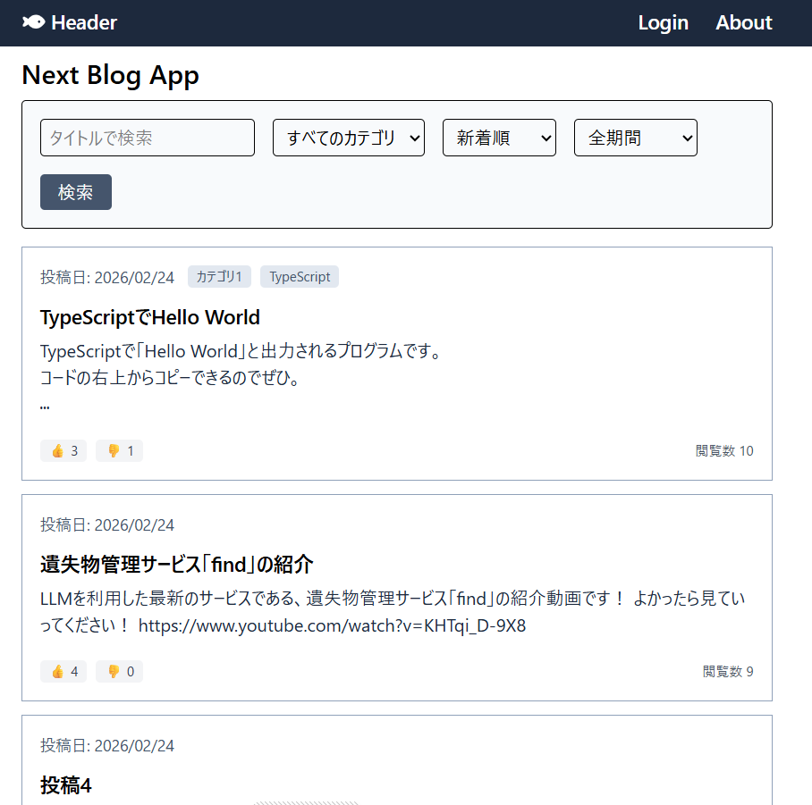
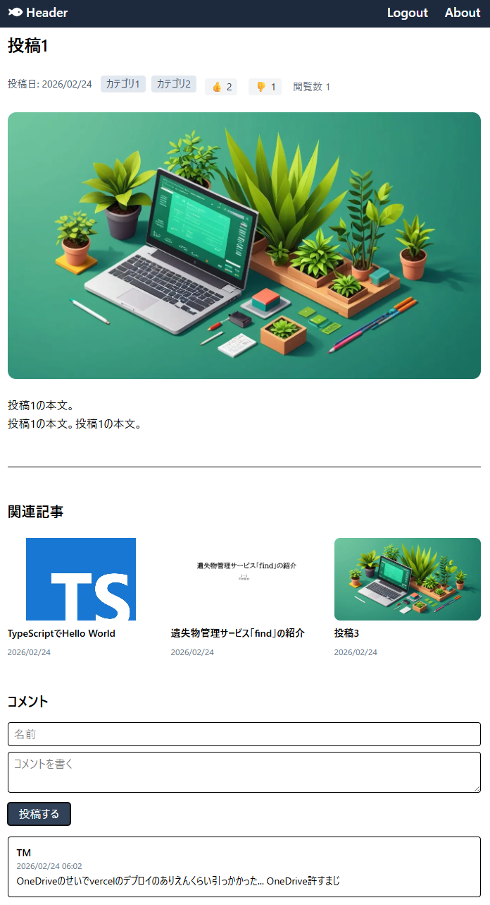
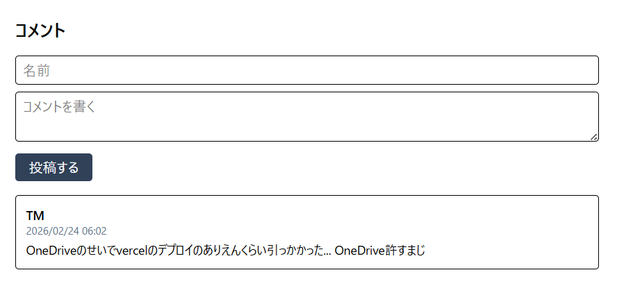
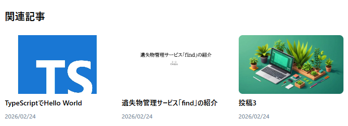
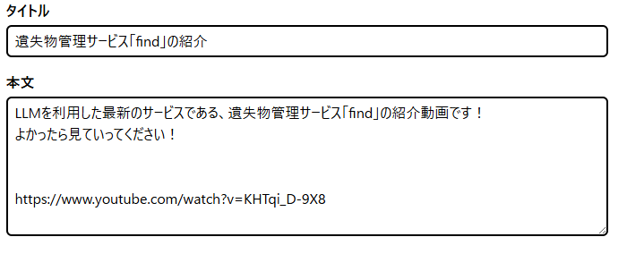
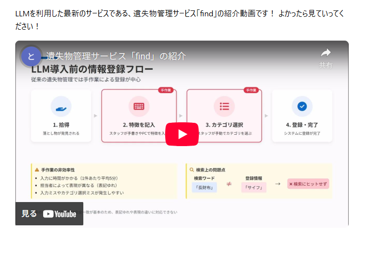
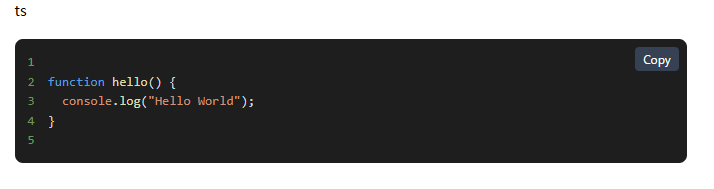

# Next Blog App

## アプリ名

Nest Blog App

---

## 概要

Next Blog App は、技術情報の発信を目的としたブログアプリケーションです。  
開発者やプログラミング学習者を主な利用者として想定し、コードや動画を埋め込める、同じ技術者にとって使いやすいブログとして設計しました。

記事の閲覧・検索・評価（👍👎）・コメント投稿が可能で、視覚的にわかりやすく、操作しやすいUIを意識しています。

---

## 開発の背景・経緯

私はプログラミングを勉強している者なので、私のブログを見る方もきっとプログラミングを嗜む方になるでしょう。なので、

基本的なブログアプリの機能の

- 検索機能
- 評価ボタン
- コメント投稿

に加え、技術者が見やすい、使いやすいよう

- コードをシンタックスハイライト付きで表示
- YouTube動画を自動埋め込み

など実装し、
**「技術者が見やすい、使いやすいブログ」**
を目指しました。

また、バックエンドからフロントエンドまで一貫して設計することで、フルスタック開発力の向上を目的としました。

---

## 公開URL

https://next-blog-3fz3p09l2-tomo0778s-projects.vercel.app/

---

# 特徴と機能の説明

## ① 記事一覧・検索・ソート機能

- タイトル検索
- カテゴリ絞り込み
- 👍数 / 👎数 / 閲覧数ソート
- 期間指定ソート（1週間・1ヶ月など）

これらのフィルター機能はプルダウンメニューになっており、それらを選択する毎に表示が切り替わるように設定している。</br>
各記事の下部に「👍」と「👎」のボタンがあり、その横に表示されている数字が増える。</br>
閲覧数は文字通りその記事に飛び、閲覧されると数字が増える。</br>



---

## ② 記事詳細ページ

### 記事詳細ページ

- カテゴリ表示
- いいね / バッド / 閲覧数表示
- コメント投稿機能
- 関連記事表示

ホームと同じように「👍」と「👎」のボタンがあり、その横に表示されている数字が増える。</br>
関連記事表示とコメント投稿機能は下に詳しく示す。



---

## ③ コメント機能（誰でも投稿可能）

- 名前＋本文入力
- 即時反映
- 投稿日時表示

各記事詳細ページの下部にコメントできる場所を設置している。</br>誰でも名前と本文を入力することで投稿することができる。



---

## ④ 関連記事表示

- 画像
- タイトル
- 投稿日時表示

各記事詳細ページの下部で関連記事3件を表示している。
</br>付与されているカテゴリで各記事に関連しているかを判断している。



---

## ⑤ YouTube動画の自動埋め込み機能

記事本文にYouTube URLを記載するだけで、自動的に動画プレイヤーへ変換される。</br>
プログラミングの説明に動画を使う場面があるかもしれないから、面倒な手順を略してURLをコピペするだけでいいようにした。

例：



↓ 自動でiframe表示



---

## ⑥ コードのシンタックスハイライト表示

- 言語ごとの色分け
- 行番号表示
- コピーボタン付き

技術記事として読みやすさを重視した。</br>
プログラミングのことをブログに載せるなら、これは絶対必要だと思い作った。</br>
右上の「Copy」ボタンを押すとコピーできる。</br>
コードの上の「ts」は言語を表している



---

# 使用技術（技術スタック）

## フロントエンド

- TypeScript
- Next.js（App Router）
- React
- Tailwind CSS
- react-syntax-highlighter
- DOMPurify
- dayjs

## バックエンド

- Next.js API Routes
- Prisma
- PostgreSQL（Supabase）

## インフラ

- Supabase（DB / Storage）
- Vercel（デプロイ）

## 開発ツール

- VSCode
- Git / GitHub

---

# システム構成図

```bash
User
↓
Vercel (Next.js)
↓
Prisma
↓
Supabase (PostgreSQL / Storage)
```

---

# 開発期間・体制

- 開発体制：個人開発
- 開発期間：2026.01.15 〜 2026.02.24（約20時間）

---

# 工夫した点・苦労した点

## ① Prismaスキーマ設計

- likes / dislikes / views 追加
- Commentモデルの追加
- リレーション設計

## ② ソート機能の動的実装

URLクエリパラメータを利用し、

- sort
- period

を組み合わせた動的な `orderBy` / `where` 条件を実装。

## ③ 動画埋め込みとDOMPurifyの共存

YouTube埋め込み時にDOMPurifyでiframeが削除される問題を解決するため、  
`ADD_TAGS` / `ADD_ATTR` を適切に設定。

## ④ コードブロックの動的レンダリング

HTML文字列を分割し、  
通常テキストとコード部分を分けてReactコンポーネントとして描画。

---

# 既知の課題と今後の展望

- mp4動画アップロード機能の実装
- 認証機能の追加
- 人気記事ランキング表示
- コメントのスパム対策

---

# 連絡先

GitHub: https://github.com/tomo0778  
Portfolio: https://tomo0778.github.io/portfolio6/
